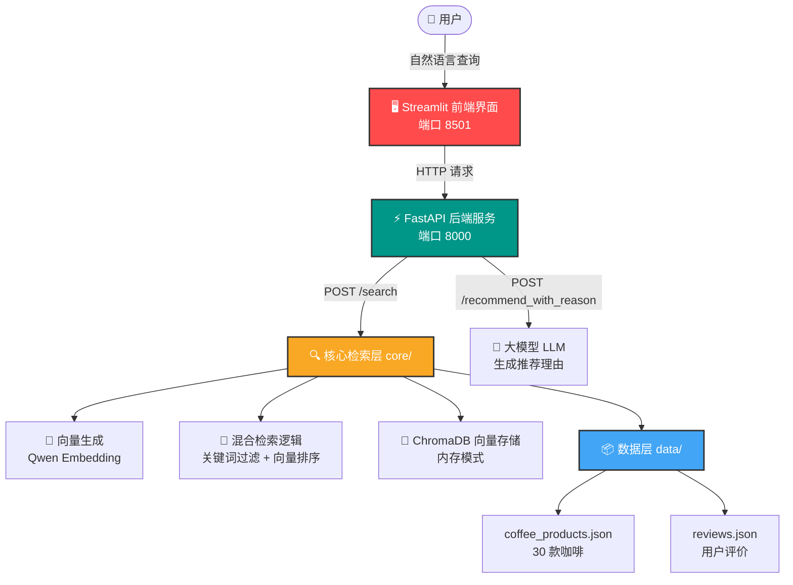

# ☕ Mocha AI 智能咖啡推荐系统

> 基于 RAG（检索增强生成）与混合检索技术的智能咖啡推荐引擎

[](https://www.python.org/)
[](https://fastapi.tiangolo.com/)
[](https://streamlit.io/)
[](https://www.trychroma.com/)

---

## 📖 项目简介

Mocha AI 是一个基于大语言模型（LLM）和向量检索技术的智能咖啡推荐系统。用户只需用自然语言描述自己的咖啡偏好（如“酸度低”、“巧克力味”、“适合做冷萃”），系统即可从 30+ 款精品咖啡中智能匹配最合适的选择，并生成人性化的推荐理由。

### 核心能力
- 🔍 **语义搜索**：理解“巧克力味”、“高酸度冰滴”等自然语言查询
- 🎯 **混合检索**：关键词精确过滤 + 向量语义排序，解决纯向量检索的误召回问题
- 🤖 **智能推荐语**（开发中）：基于大模型生成温暖、个性化的推荐理由
- ⚡ **全链路响应**：从查询到结果展示，< 500ms

---

## 🏗️ 系统架构



---

## 🛠️ 技术栈

| 层级 | 技术 | 说明 |
|---|---|---|
| 前端展示 | **Streamlit** | Python 原生 Web 框架，快速搭建演示界面 |
| 后端 API | **FastAPI + Uvicorn** | 高性能异步 RESTful API，自动生成 Swagger 文档 |
| 向量生成 | **Qwen3.7-Text-Embedding** | 阿里云通义千问 embedding，中文语义理解能力强 |
| 向量数据库 | **ChromaDB (内存模式)** | 轻量级向量数据库，无需独立部署 |
| 检索策略 | **混合检索** | 关键词预过滤 + 向量语义排序 |
| 大模型 (阶段三) | **DeepSeek / Qwen** | 生成自然语言推荐语 |

---

## 📂 项目结构

```text
coffee-rag-recommender/
├── data/                       # 数据目录
│   ├── coffee_products.json    # 30 款咖啡产品数据
│   └── reviews.json            # 用户评价数据
├── core/                       # 核心检索层
│   ├── embedding.py            # 向量生成（Qwen API 封装）
│   ├── retrieval.py            # 混合检索核心逻辑
│   └── database.py             # ChromaDB 连接与数据加载
├── api/
│   └── main.py                 # FastAPI 主文件（/search 接口）
├── scripts/
│   ├── load_and_embed.py       # 数据向量化并存入 ChromaDB
│   └── search_test.py          # 命令行检索测试
├── app.py                      # Streamlit 前端界面
├── requirements.txt            # Python 依赖
└── README.md                   # 项目说明
```

---

## 🚀 快速启动

### 1. 克隆项目

```bash
git clone <your-repo-url>
cd coffee-rag-recommender

2. 安装依赖
bash
pip install -r requirements.txt
3. 配置 API Key
在 core/embedding.py 中配置你的 DashScope API Key（阿里云百炼平台申请）：

python
dashscope.api_key = "sk-xxxxxxxxxxxxxxxx"
4. 初始化向量数据库（首次运行）
bash
python scripts/load_and_embed.py
预期输出：

text
✅ 成功存入 30 条咖啡数据到 ChromaDB
5. 启动服务
终端 1 —— 启动后端 API：


uvicorn api.main:app --reload --host 0.0.0.0 --port 8000

访问 Swagger 文档：http://localhost:8000/docs

终端 2 —— 启动前端界面：

bash
streamlit run app.py 

访问界面：http://localhost:8501

📡 API 接口文档
POST /search
请求体：

json
{
  "query": "巧克力味",
  "top_k": 3
}
响应体：

json
{
  "query": "巧克力味",
  "results": [
    {
      "name": "巴西·喜拉朵 日晒",
      "price": 72.0,
      "acidity": "低酸度",
      "suitable_for": ["美式", "拿铁", "手冲"],
      "similarity": 0.57
    }
  ]
}
📊 测试用例与验证结果
查询	Top 1 结果	验证结果
"冷萃"	哥斯达黎加·塔拉苏 蜜处理	✅ 全部支持冷萃
"低酸度 手冲"	巴西·喜拉朵 日晒	✅ 低酸 + 支持手冲
"深度烘焙 拿铁"	意式·深焙 拼配	✅ 精准命中
"高酸度 冰滴"	肯尼亚·AA 水洗	✅ 高酸 + 支持冰滴
"巧克力味"	巴西·喜拉朵 日晒	✅ 语义关联准确
🔑 核心技术亮点
1. 混合检索策略
问题：纯向量检索时，搜索"冷萃"会误召回"美式/拿铁/手冲"的咖啡（因为它们都是"咖啡制作方式"）。

解决方案：关键词精确预过滤 + 向量语义排序

python
# 先精确过滤：只保留支持"冷萃"的咖啡
# 再向量排序：对候选集按语义相似度排序
2. 文本构造策略
将结构化字段（酸度、风味、适合场景、用户评价）拼接为自然语言段落，提升向量检索精度：

text
产品名称: 巴西·喜拉朵 日晒。酸度: 低酸度。
风味: 花生、牛奶巧克力、谷物、红糖。
适合冲泡方式: 美式、拿铁、手冲。
用户评价: 每天喝都不会腻，性价比之王。
🧪 如何运行测试
bash
# 命令行检索测试
python scripts/search_test.py
📝 后续计划
☑ 数据准备与向量化
☑ 混合检索逻辑实现
☑ FastAPI 后端封装
☑ Streamlit 前端界面
□ LLM 智能推荐语生成（接入 DeepSeek/Qwen）
□ 云端部署（Streamlit Cloud / 阿里云）
🤝 关于项目
这个项目是我从 PHP 后端开发 转型 AI 应用开发 的实践作品。项目从零开始，独立完成了数据设计、向量化、检索策略、API 封装和前端展示的全链路开发。

📄 License
MIT License

text

---
